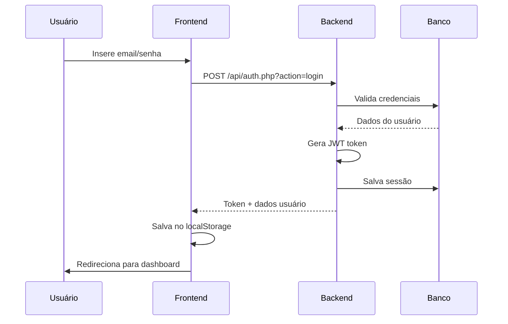
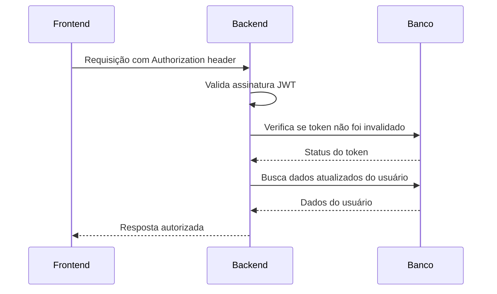

# 🔐 Sistema de Autenticação - Poker SaaS

## 📋 Visão Geral

O sistema implementa **autenticação JWT (JSON Web Token)** com arquitetura **multi-tenant** para isolamento de dados por empresa. Inclui controle de roles, auditoria completa e middleware de segurança.

## 🏗️ Arquitetura do Sistema

### **Frontend (React)**
- **Context API** para gerenciamento de estado de autenticação
- **LocalStorage** para persistência de token e dados do usuário
- **Interceptação automática** de requisições com token
- **Redirecionamento automático** em caso de token expirado

### **Backend (PHP)**
- **JWT com assinatura HMAC-SHA256**
- **Middleware de autenticação** obrigatório
- **Sistema de sessões** no banco de dados
- **Controle de tentativas** de login com bloqueio
- **Logs de auditoria** completos

## 🔄 Fluxo de Autenticação

### **1. Login do Usuário**



### **2. Verificação de Token**



## 📁 Estrutura de Arquivos

```
api/
├── auth.php                 # Endpoints de autenticação
├── jwt_helper.php           # Geração e validação de JWT
├── middleware/
│   └── auth_middleware.php  # Middleware de autenticação
├── config.php               # Configurações e CORS
└── session.php              # APIs protegidas

src/
├── contexts/
│   └── AuthContext.jsx      # Context de autenticação
├── services/
│   └── api.js               # Cliente API com interceptação
└── pages/
    └── Login/
        └── index.jsx        # Página de login
```

## 🔧 Implementação Técnica

### **Backend - Geração de JWT**

```php
// jwt_helper.php
public static function generateToken($user_data) {
    $header = json_encode(['typ' => 'JWT', 'alg' => 'HS256']);
    
    $payload = json_encode([
        'user_id' => $user_data['id'],
        'tenant_id' => $user_data['tenant_id'],
        'email' => $user_data['email'],
        'name' => $user_data['name'],
        'role' => $user_data['role'],
        'tenant_name' => $user_data['tenant_name'],
        'tenant_plan' => $user_data['tenant_plan'],
        'iat' => time(),
        'exp' => time() + (24 * 60 * 60), // 24 horas
        'iss' => 'poker_saas_system'
    ]);
    
    $base64Header = self::base64UrlEncode($header);
    $base64Payload = self::base64UrlEncode($payload);
    
    $signature = hash_hmac('sha256', 
        $base64Header . "." . $base64Payload, 
        self::getSecretKey(), true);
    $base64Signature = self::base64UrlEncode($signature);
    
    return $base64Header . "." . $base64Payload . "." . $base64Signature;
}
```

### **Frontend - Context de Autenticação**

```javascript
// AuthContext.jsx
export const AuthProvider = ({ children }) => {
  const [user, setUser] = useState(null);
  const [loading, setLoading] = useState(true);

  const login = async (email, password) => {
    try {
      const response = await api.login(email, password);
      setUser(response.data.user);
      return response.data;
    } catch (error) {
      setError(error.message);
      throw error;
    }
  };

  const checkAuth = async () => {
    if (!api.getToken()) {
      setUser(null);
      return;
    }

    try {
      const response = await api.verifyToken();
      setUser(response.data.user);
    } catch (error) {
      setUser(null);
      api.clearAuth();
    }
  };
};
```

### **Middleware de Autenticação**

```php
// auth_middleware.php
public static function requireAuth($pdo) {
    $token = JWTHelper::getTokenFromHeaders();
    
    if (!$token) {
        http_response_code(401);
        echo json_encode(['error' => 'Token de autenticação necessário']);
        exit;
    }
    
    $payload = JWTHelper::validateToken($token);
    if (!$payload) {
        http_response_code(401);
        echo json_encode(['error' => 'Token inválido ou expirado']);
        exit;
    }
    
    if (!JWTHelper::isTokenValid($pdo, $token)) {
        http_response_code(401);
        echo json_encode(['error' => 'Token foi invalidado']);
        exit;
    }
    
    // Buscar dados atuais do usuário
    $user = self::getCurrentUserData($pdo, $payload['user_id']);
    return $user;
}
```

## 🛡️ Recursos de Segurança

### **1. Controle de Tentativas de Login**

```php
// Bloqueio após 5 tentativas por 30 minutos
if ($attempts >= 5) {
    $locked_until = date('Y-m-d H:i:s', time() + (30 * 60));
    $updateSql = "UPDATE users SET login_attempts = ?, locked_until = ? WHERE id = ?";
    $updateStmt->execute([$attempts, $locked_until, $user['id']]);
}
```

### **2. Sistema Multi-Tenant**

```php
// Isolamento por tenant_id
$sql = "SELECT * FROM sessions WHERE tenant_id = ? ORDER BY date DESC";
$stmt = $pdo->prepare($sql);
$stmt->execute([$tenant_id]);
```

### **3. Controle de Roles**

```php
// Hierarquia: user < admin < super_admin
$role_hierarchy = ['user' => 1, 'admin' => 2, 'super_admin' => 3];
$user_level = $role_hierarchy[$user_role] ?? 0;
$required_level = $role_hierarchy[$required_role] ?? 999;

if ($user_level < $required_level) {
    http_response_code(403);
    echo json_encode(['error' => 'Permissões insuficientes']);
    exit;
}
```

### **4. Logs de Auditoria**

```php
// Log automático de todas as ações
public static function logAction($pdo, $action, $table_name, $record_id, $old_data, $new_data) {
    $sql = "INSERT INTO audit_logs (tenant_id, user_id, action, table_name, record_id, old_data, new_data, ip_address, user_agent, created_at) 
            VALUES (?, ?, ?, ?, ?, ?, ?, ?, ?, NOW())";
    
    $stmt = $pdo->prepare($sql);
    $stmt->execute([
        self::$current_user['tenant_id'],
        self::$current_user['id'],
        $action, $table_name, $record_id,
        $old_data ? json_encode($old_data) : null,
        $new_data ? json_encode($new_data) : null,
        $_SERVER['REMOTE_ADDR'] ?? null,
        $_SERVER['HTTP_USER_AGENT'] ?? null
    ]);
}
```

## 🚨 Problemas Identificados

### **1. Chave JWT Hardcoded**
```php
// ❌ PROBLEMA: Chave fixa se não tiver .env
self::$secret_key = $_ENV['JWT_SECRET'] ?? 'poker_saas_secret_key_2025_' . hash('sha256', 'luisfboff_poker');
```

**✅ SOLUÇÃO:**
```bash
# .env
JWT_SECRET=chave_super_secreta_aleatoria_de_64_caracteres_2025
```

### **2. Refresh Token Não Implementado**
```php
// ❌ PROBLEMA: Refresh token não funciona
success([
    'message' => 'Refresh token não implementado ainda',
    'action' => 'Faça login novamente'
]);
```

**✅ SOLUÇÃO:**
```php
public static function validateRefreshToken($pdo, $refresh_token) {
    $sql = "SELECT user_id FROM user_sessions WHERE refresh_token = ? AND expires_at > NOW()";
    $stmt = $pdo->prepare($sql);
    $stmt->execute([hash('sha256', $refresh_token)]);
    $session = $stmt->fetch();
    
    if ($session) {
        // Gerar novo JWT
        return self::generateToken($user_data);
    }
    return false;
}
```

### **3. CORS Muito Permissivo**
```php
// ❌ PROBLEMA: Permite qualquer origem
header('Access-Control-Allow-Origin: *');
```

**✅ SOLUÇÃO:**
```php
$allowed_origins = [
    'https://seudominio.com',
    'https://www.seudominio.com',
    'http://localhost:3000' // Para desenvolvimento
];

$origin = $_SERVER['HTTP_ORIGIN'] ?? '';
if (in_array($origin, $allowed_origins)) {
    header("Access-Control-Allow-Origin: $origin");
}
```

### **4. Senha Temporária no Registro**
```php
// ❌ PROBLEMA: Senha fixa para novos usuários
$password_hash = password_hash('temp123', PASSWORD_DEFAULT);
```

**✅ SOLUÇÃO:**
```php
// Gerar senha aleatória e enviar por email
$temp_password = bin2hex(random_bytes(8));
$password_hash = password_hash($temp_password, PASSWORD_DEFAULT);

// Enviar email com senha temporária
sendWelcomeEmail($email, $temp_password);
```

## 🔧 Configuração de Produção

### **1. Arquivo .env**
```bash
# Banco de dados
DB_HOST=localhost
DB_NAME=poker_saas
DB_USER=usuario_seguro
DB_PASSWORD=senha_super_segura

# JWT
JWT_SECRET=chave_jwt_aleatoria_de_64_caracteres_minimo

# Email
SMTP_HOST=smtp.gmail.com
SMTP_PORT=587
SMTP_USER=seu_email@gmail.com
SMTP_PASS=sua_senha_app

# CORS
ALLOWED_ORIGINS=https://seudominio.com,https://www.seudominio.com
```

### **2. Configuração do Servidor**

```apache
# .htaccess para Apache
RewriteEngine On
RewriteCond %{REQUEST_FILENAME} !-f
RewriteCond %{REQUEST_FILENAME} !-d
RewriteRule ^api/(.*)$ api/$1 [L]

# Headers de segurança
Header always set X-Content-Type-Options nosniff
Header always set X-Frame-Options DENY
Header always set X-XSS-Protection "1; mode=block"
```

### **3. Configuração Nginx**

```nginx
# nginx.conf
location /api/ {
    try_files $uri $uri/ /api/index.php?$query_string;
    
    # Headers de segurança
    add_header X-Content-Type-Options nosniff;
    add_header X-Frame-Options DENY;
    add_header X-XSS-Protection "1; mode=block";
    
    # CORS
    add_header Access-Control-Allow-Origin "https://seudominio.com";
    add_header Access-Control-Allow-Methods "GET, POST, PUT, DELETE, OPTIONS";
    add_header Access-Control-Allow-Headers "Content-Type, Authorization";
}
```

## 🐛 Debug de Problemas

### **1. Verificar Logs do Servidor**
```bash
# Apache
tail -f /var/log/apache2/error.log

# Nginx
tail -f /var/log/nginx/error.log

# PHP
tail -f /var/log/php/error.log
```

### **2. Teste da API**
```bash
# Teste de login
curl -X POST http://seudominio.com/api/auth.php?action=login \
  -H "Content-Type: application/json" \
  -d '{"email":"teste@email.com","password":"senha123"}'

# Teste com token
curl -X GET http://seudominio.com/api/auth.php?action=verify \
  -H "Authorization: Bearer SEU_TOKEN_AQUI"
```

### **3. Debug no Código**
```php
// Adicionar logs temporários
error_log("Login attempt: " . $email);
error_log("JWT Generated: " . substr($token, 0, 50));
error_log("DB Connection: " . ($pdo ? "OK" : "FAILED"));
```

### **4. Verificar Banco de Dados**
```sql
-- Verificar usuários
SELECT id, email, is_active, last_login FROM users;

-- Verificar sessões ativas
SELECT * FROM user_sessions WHERE expires_at > NOW();

-- Verificar logs de auditoria
SELECT * FROM audit_logs ORDER BY created_at DESC LIMIT 10;
```

## 📊 Monitoramento

### **1. Métricas de Autenticação**
```sql
-- Tentativas de login por dia
SELECT DATE(created_at) as date, COUNT(*) as attempts
FROM audit_logs 
WHERE action = 'failed_login' 
GROUP BY DATE(created_at);

-- Usuários ativos
SELECT COUNT(*) as active_users 
FROM user_sessions 
WHERE expires_at > NOW();

-- Sessões por tenant
SELECT t.name, COUNT(s.id) as sessions
FROM tenants t
LEFT JOIN user_sessions s ON t.id = s.tenant_id
GROUP BY t.id, t.name;
```

### **2. Alertas de Segurança**
```php
// Detectar tentativas suspeitas
$suspicious_attempts = $pdo->query("
    SELECT ip_address, COUNT(*) as attempts 
    FROM audit_logs 
    WHERE action = 'failed_login' 
    AND created_at > DATE_SUB(NOW(), INTERVAL 1 HOUR)
    GROUP BY ip_address 
    HAVING attempts > 10
")->fetchAll();

if (!empty($suspicious_attempts)) {
    // Enviar alerta para admin
    sendSecurityAlert($suspicious_attempts);
}
```

## 🚀 Melhorias Futuras

### **1. Autenticação 2FA**
```php
// Implementar TOTP (Google Authenticator)
class TwoFactorAuth {
    public static function generateSecret() {
        return base32_encode(random_bytes(20));
    }
    
    public static function verifyCode($secret, $code) {
        $timeSlice = floor(time() / 30);
        return self::calculateCode($secret, $timeSlice) === $code;
    }
}
```

### **2. OAuth Social**
```php
// Login com Google/Facebook
class SocialAuth {
    public static function googleLogin($code) {
        // Validar code com Google
        // Criar/atualizar usuário
        // Gerar JWT
    }
}
```

### **3. Rate Limiting**
```php
// Limitar requisições por IP
class RateLimiter {
    public static function checkLimit($ip, $endpoint) {
        $key = "rate_limit:{$ip}:{$endpoint}";
        $attempts = redis()->get($key) ?: 0;
        
        if ($attempts > 100) { // 100 req/hora
            throw new Exception('Rate limit exceeded');
        }
        
        redis()->incr($key);
        redis()->expire($key, 3600); // 1 hora
    }
}
```

## 📝 Checklist de Segurança

- [ ] **Chave JWT segura** (64+ caracteres aleatórios)
- [ ] **HTTPS obrigatório** em produção
- [ ] **CORS restritivo** (apenas domínios permitidos)
- [ ] **Rate limiting** implementado
- [ ] **Logs de auditoria** funcionando
- [ ] **Controle de tentativas** ativo
- [ ] **Refresh token** implementado
- [ ] **Senhas temporárias** seguras
- [ ] **Headers de segurança** configurados
- [ ] **Backup do banco** automatizado

## 🆘 Troubleshooting Comum

### **Problema: "Token inválido"**
- Verificar se JWT_SECRET está configurado
- Verificar se token não expirou
- Verificar se token não foi invalidado no banco

### **Problema: "CORS error"**
- Verificar configuração de CORS no servidor
- Verificar se domínio está na lista de permitidos
- Verificar se requisição está sendo feita via HTTPS

### **Problema: "Database error"**
- Verificar conexão com banco
- Verificar se tabelas existem
- Verificar permissões do usuário do banco

### **Problema: "Login não funciona"**
- Verificar se usuário está ativo
- Verificar se tenant está ativo
- Verificar se conta não está bloqueada
- Verificar logs de auditoria

---

**📅 Última atualização:** Janeiro 2025  
**👨‍💻 Desenvolvido por:** Luis Fernando  
**🔗 Repositório:** Poker SaaS Multi-tenant
